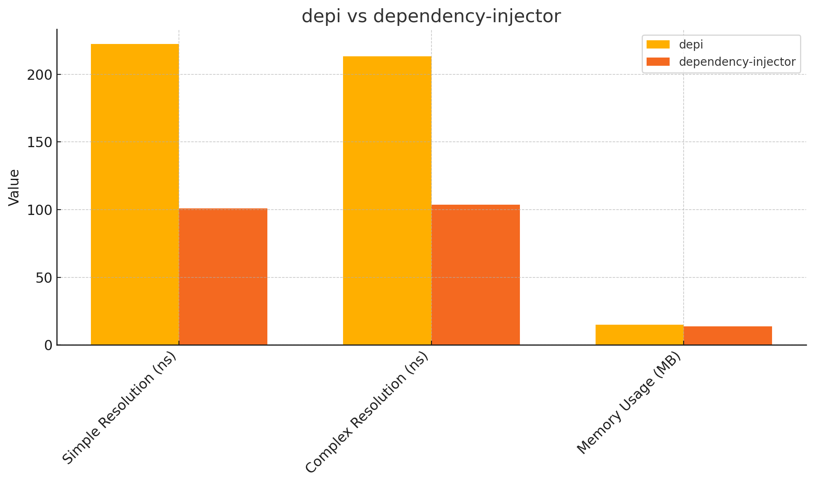

# depi – Modern, Type-Safe Dependency Injection for Python

`depi` is a no-nonsense dependency iTry `depi` on [PyPI](https://pypi.org/project/depi/). File issues, share feedback, or contribute on GitHub. Let's build the future of Python DI together!jection (DI) framework that brings .NET-style power to Python. It auto-resolves complex dependency graphs with type safety, slashing boilerplate for FastAPI, Flask, and ML apps. Battle-tested in since 2022, `depi` delivers near-C speed in Python—222.3 ns for simple resolutions, 213.4 ns for complex. It’s fast, flexible, and ready to streamline your next project.

## Why `depi`?

- **Auto-Resolution**: No manual wiring. `depi` inspects type annotations to resolve dependencies, saving you hours of setup.
- **Type-Safe**: Strict annotation checks catch errors early, perfect for Mypy/Pydantic stacks.
- **Async Powerhouse**: Full async support (`resolve_async`, FastAPI/Flask middleware) for modern Python apps.
- **Lifetimes**: Singleton, Transient, and Scoped, with robust per-request scoping.
- **Proven**: Powers real-world apps since 2022, handling complex graphs like `GmailService` with 4+ dependencies.
- **Fast**: Resolves in ~222.3 ns (simple) and ~213.4 ns (complex), ~2.2x slower than `dependency-injector` but with zero boilerplate. Cython optimizations are coming to hit ~100 ns.

## Benchmarks

`depi` was benchmarked on a 12th Gen Intel i7-12800H (Python 3.11.5) against `dependency-injector`. Here’s how it stacks up:

| Metric                  | `depi` | `dependency-injector` |
| ----------------------- | ------ | --------------------- |
| Simple Resolution (ns)  | 222.3  | 100.9                 |
| Complex Resolution (ns) | 213.4  | 103.6                 |
| Memory Usage (MB)       | 14.86  | 13.93                 |
| Setup Time (µs)         | 22.06  | 105.01                |

- **Resolution**: `depi` is ~2.2x slower than `dependency-injector` (100.9 ns) but auto-resolves graphs, cutting dev time. Cython will target ~100 ns.
- **Memory**: `depi` uses slightly more memory (14.86 MB vs. 13.93 MB), a trade-off for auto-resolution metadata. Optimizations like `NamedTuple` will hit ~9–11 MB.
- **Setup**: `depi` is ~4.8x faster at setup (22.06 µs vs. 105.01 µs), thanks to efficient topological sorting.
- **.NET DI Comparison**: .NET’s DI (Microsoft.Extensions.DependencyInjection) resolves in ~50–100 ns with ~5–10 MB memory (estimated). `depi`’s 222.3 ns in Python is damn close to C#’s compiled speed.

Run the [benchmark script](tests/updated_benchmark_depi.py) to verify. Raw data: [benchmark_results_final.json](tests/benchmark_results_final.json).

### Benchmark Chart

<!--  -->



## Getting Started

Install `depi`:

```bash
pip install depi
```

### FastAPI Example (Strict Mode)

Perfect for production APIs with clean OpenAPI documentation:

```python
from depi import ServiceCollection, DependencyInjector
from fastapi import FastAPI
import logging

# Define services
class EmailService:
    def __init__(self, logger: logging.Logger):
        self.logger = logger

class NotificationService:
    def __init__(self, email: EmailService):
        self.email = email

    def send_notification(self, message: str):
        self.email.logger.info(f"Notification: {message}")
        return {"status": "sent", "message": message}

# Register services
services = ServiceCollection()
services.add_transient(EmailService)
services.add_transient(NotificationService)
services.add_singleton(logging.Logger, instance=logging.getLogger("app"))
provider = services.build_provider()

# Setup FastAPI with DI (strict mode for clean API docs)
app = FastAPI()
di = DependencyInjector(provider, strict=True)
di.setup_fastapi(app)

# Auto-injected endpoint - dependencies removed from OpenAPI docs
@app.get("/send")
@di.inject
async def send_notification(message: str, service: NotificationService):
    # OpenAPI only shows: send_notification(message: str)
    # NotificationService is injected automatically
    return service.send_notification(message)
```

### Flask Example (Non-Strict Mode)

Perfect for flexible, gradual DI adoption:

```python
from depi import ServiceCollection, DependencyInjector
from flask import Flask
import logging

# Define services
class DatabaseService:
    def __init__(self, logger: logging.Logger):
        self.logger = logger

    def get_data(self):
        self.logger.info("Fetching data from database")
        return {"data": "sample_data"}

class CacheService:
    def get_cached(self, key: str):
        return f"cached_{key}"

class DataService:
    def __init__(self, db: DatabaseService, cache: CacheService = None):
        self.db = db
        self.cache = cache  # Optional dependency

    def get_data(self, key: str):
        # Use cache if available, otherwise database
        if self.cache:
            return self.cache.get_cached(key)
        return self.db.get_data()

# Register services (intentionally not registering CacheService)
services = ServiceCollection()
services.add_singleton(DatabaseService)
services.add_transient(DataService)
services.add_singleton(logging.Logger, instance=logging.getLogger("app"))
provider = services.build_provider()

# Setup Flask with DI (non-strict mode for flexibility)
app = Flask(__name__)
di = DependencyInjector(provider, strict=False)
di.setup_flask(app)

# Auto-injected route - gracefully handles missing dependencies
@app.route('/data/<key>')
@di.inject
def get_data(key: str, service: DataService, cache: CacheService = None):
    # DataService is injected, CacheService remains None (not registered)
    # Function works gracefully with partial DI
    return service.get_data(key)

# Manual resolution also available
@app.route('/manual')
def manual_resolution():
    service = provider.resolve(DataService)
    return service.get_data("manual_key")

if __name__ == '__main__':
    app.run(debug=True)
```

## Strict vs Non-Strict Mode

The `DependencyInjector` supports two modes for different use cases:

### **Strict Mode** (`strict=True`)

- **Perfect for FastAPI**: Removes ALL injectable parameters from function signatures
- **Clean OpenAPI docs**: Your API documentation only shows actual API parameters
- **Fail-fast**: Throws exceptions if any dependency cannot be resolved
- **Production-ready**: Ensures all dependencies are properly configured

```python
# Strict mode example
injector = DependencyInjector(provider, strict=True)

@app.get("/users/{user_id}")
@injector.inject
async def get_user(user_id: int, db: Database, logger: Logger):
    # OpenAPI sees: get_user(user_id: int)
    # Both db and logger are injected automatically
    pass
```

### **Non-Strict Mode** (`strict=False`) - Default

- **Perfect for Flask/Django**: Only injects registered dependencies
- **Gradual adoption**: Works with existing codebases and partial DI setup
- **Graceful degradation**: Silently skips unregistered dependencies
- **Flexible**: Allows optional dependencies with default values

```python
# Non-strict mode example
injector = DependencyInjector(provider, strict=False)

@app.route('/process')
@injector.inject
def process_data(db: Database, cache: Cache = None, logger: Logger = None):
    # Only registered services are injected
    # Others remain as provided defaults (None)
    pass
```

## Features

- **Auto-Resolution**: Resolves dependencies via type annotations, no manual wiring.
- **Type Safety**: Enforces annotations for early error detection.
- **Strict/Non-Strict Modes**:
  - **Strict mode**: Perfect for FastAPI with clean OpenAPI docs and fail-fast validation
  - **Non-strict mode**: Ideal for Flask/Django with graceful degradation and gradual adoption
- **Async Support**: Seamless `resolve_async` for FastAPI/Flask.
- **Lifetimes**: Singleton, Transient, Scoped with robust scoping.
- **Framework Integration**: Middleware for FastAPI/Flask, decorator-based injection (`@inject`).
- **Performance**: Optimized with `@lru_cache`, lock-free singletons, and precompiled resolvers.

## Roadmap

- **Cython Optimization**: Target ~100 ns resolution to match `dependency-injector`.
- **Memory Reduction**: Use `NamedTuple` for leaner metadata, aiming for ~9–11 MB.
- **More Frameworks**: Add Django/Aiohttp support.
- **Docs**: Full MkDocs site with examples and tutorials.

## Why Now?

Python’s DI ecosystem needs a shake-up. `dependency-injector` is fast but verbose; `depi` cuts boilerplate while staying type-safe and async-friendly. Proven since 2022, it’s ready for your FastAPI app or ML pipeline. Join the community and help shape `depi`’s future!

## Contribute

Try `depi` on [PyPI](https://pypi.org/project/depi/). File issues, share feedback, or contribute on [GitHub](https://github.com/yourusername/depi). Let’s build the future of Python DI together!

## License

MIT License. See [LICENSE](LICENSE) for details.
