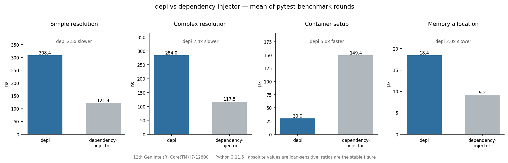

# depi – Dependency Injection for Python

`depi` is a type-safe dependency injection container that resolves dependency graphs from constructor type annotations. The core has **no dependencies** and knows nothing about the web; framework support ships as separate, independently versioned packages.

Interested in `depi`'s lineage before the dawn of AI? `depi` has been in iterative development since 2020! (lineage from 2022: https://github.com/danleonard-nj/framework/tree/main/framework/di)

## Packages

This repository is a monorepo. Each package is its own distribution with its own release cadence, so a framework changing under an adapter never forces a core release — and never drags a web framework into an application that only wanted the container.

| Package          | Import         | Depends on          |
| ---------------- | -------------- | ------------------- |
| `pydepi`         | `depi`         | *nothing*           |
| `pydepi-flask`   | `depi_flask`   | `pydepi`, `flask`   |
| `pydepi-quart`   | `depi_quart`   | `pydepi`, `quart`   |
| `pydepi-fastapi` | `depi_fastapi` | `pydepi`, `fastapi` |
| `pydepi-django`  | `depi_django`  | `pydepi`, `django`  |

Tests for every package live together under `tests/`, so an adapter breaking against a new framework release is caught immediately — but they run as separate CI jobs, so a broken adapter cannot turn the core suite red.

## Installation

```bash
pip install pydepi
```

`pip install pydepi` pulls in nothing else. Framework support is a separate install:

```bash
pip install pydepi-flask
```

Extras are also accepted as an alias — `pydepi[flask]`, `[quart]`, `[fastapi]`, `[django]`, `[all]` — but the name above is the more accurate form, since these are distinct distributions with their own versions rather than optional features of core.

## Quick Start

```python
from depi import ServiceCollection

class Config:
    def __init__(self):
        self.dsn = 'postgres://localhost/app'

class Database:
    def __init__(self, config: Config):      # resolved from the annotation
        self.dsn = config.dsn

class UserService:
    def __init__(self, db: Database):
        self.db = db

services = ServiceCollection()
services.add_singleton(Config)
services.add_scoped(Database)
services.add_transient(UserService)

provider = services.build_provider()
user_service = provider.resolve(UserService)
```

Every constructor parameter must carry a type annotation; an unannotated parameter is an error at registration time rather than a surprise at resolution time.

### Registration Forms

```python
services.add_singleton(ILogger, ConsoleLogger)        # interface -> implementation
services.add_singleton(ILogger, instance=my_logger)   # pre-built instance
services.add_scoped(Repository, factory=repo_factory) # factory (see below)
services.register_many([UserService, OrderService], lifetime=Lifetime.Singleton)

provider = services.build_provider(eager_all=True)    # construct singletons at build time
```

## Lifetimes

- **Transient** – a new instance on every resolution
- **Singleton** – one instance for the life of the provider
- **Scoped** – one instance per scope, typically per HTTP request

Scopes are context managers, and disposal is explicit:

```python
with provider.create_scope() as scope:
    repo = scope.resolve(Repository)   # same instance for the whole block
# scope disposed here: dispose() is called on any scoped instance that defines it
```

Async cleanup is supported too — `async with provider.create_scope()` awaits `__aexit__` on scoped instances before disposing them.

## Framework Integrations

Every adapter does the same three things: open a scope per request, bind it to the ambient context, and dispose it when the request ends. What differs is how the scope reaches your view.

### Two injection modes

**Provider injection (default).** The request scope is handed to the view and you resolve from it explicitly. Works with every framework.

**Autowire (opt-in).** Parameters annotated with registered types are resolved and passed individually. Parameters the container doesn't know about are left for the framework to fill — that's how URL arguments still work. **Not available on FastAPI**, which reads endpoint signatures to build request parsing and the OpenAPI schema, and raises at decoration time on any annotation it cannot treat as a Pydantic field.

### Flask

```python
from flask import Flask
from depi import ServiceCollection
from depi_flask import FlaskInjector

app = Flask(__name__)
provider = services.build_provider()

injector = FlaskInjector(provider)
injector.setup(app)

@app.route('/users/<user_id>')
@injector.inject
def get_user(user_id, provider):
    return provider.resolve(UserService).get(user_id)
```

With autowire:

```python
injector = FlaskInjector(provider, autowire=True)
injector.setup(app)

@app.route('/users/<user_id>')
@injector.inject
def get_user(user_id, users: UserService):   # user_id stays Flask's
    return users.get(user_id)
```

### Quart

Identical to Flask, with async views. `inject` uses `functools.wraps`, so it composes inside a decorator stack — route registration, authentication, response handling — without the outer layers losing the view's identity:

```python
from depi_quart import QuartInjector

injector = QuartInjector(provider, param_name='container')
injector.setup(app)

@app.route('/users/<user_id>')
@injector.inject
async def get_user(user_id, container):
    users = await container.resolve_async(UserService)
    return await users.get(user_id)
```

`param_name` renames the injected keyword argument, so an existing convention (`container`, `services`, …) does not require a fork.

### FastAPI

FastAPI uses `Depends`, so depi never touches your endpoint signature and your OpenAPI schema stays clean:

```python
from fastapi import Depends, FastAPI
from depi_fastapi import FastAPIInjector

app = FastAPI()
injector = FastAPIInjector(provider)
injector.setup(app)

@app.get('/users/{user_id}')
async def get_user(user_id: str, scope=Depends(injector.get_scope)):
    return scope.resolve(UserService).get(user_id)
```

Scope management is a pure ASGI middleware rather than an `http` middleware decorator, for two reasons: the contextvar is set in the same context the endpoint coroutine runs in, and disposal happens after the response body is sent rather than when the handler returns.

### Django

Django builds middleware itself from a dotted path, so the injector registers itself at startup instead of being constructed inline:

```python
# apps.py
from django.apps import AppConfig
from depi_django import DjangoInjector

class MyAppConfig(AppConfig):
    name = 'myapp'

    def ready(self):
        DjangoInjector(build_provider()).setup()

# settings.py
MIDDLEWARE = ['depi_django.DepiScopeMiddleware', ...]

# views.py
@injector.inject
def get_user(request, user_id, provider):
    return JsonResponse(provider.resolve(UserService).get(user_id))
```

The middleware matches whatever `get_response` it is given, so both the sync and async request paths work.

### Reaching the scope directly

Anything running inside a request can reach the scope without it being threaded through:

```python
from depi import current_scope, get_current_scope, use_scope

scope = current_scope()          # raises NoActiveScopeError if there is none
scope = get_current_scope()      # returns None instead

with use_scope(my_scope):        # bind manually, e.g. in a worker or a test
    ...
```

## Factories

A factory receives **one argument: the provider or scope**. Resolve what you need from it:

```python
def database_factory(provider) -> DatabaseConnection:
    config = provider.resolve(AppConfig)
    logger = provider.resolve(Logger)
    if config.environment == 'production':
        return ProductionDatabase(config.db_url, pool_size=config.db_pool_size, logger=logger)
    return InMemoryDatabase(logger=logger)

services.add_singleton(DatabaseConnection, factory=database_factory)
```

Async factories are supported and are awaited by `resolve_async`:

```python
async def client_factory(provider) -> HttpClient:
    client = HttpClient(provider.resolve(AppConfig).api_base_url)
    await client.connect()
    return client

services.add_singleton(HttpClient, factory=client_factory)
client = await provider.resolve_async(HttpClient)
```

Singleton factories — async ones included — are constructed during `build_provider()`, so `resolve()` returns the finished instance. Transient and scoped factories run per resolution, and calling the synchronous `resolve()` on an async one raises a `RuntimeError` pointing at `resolve_async()` rather than handing back an un-awaited coroutine.

## Registering One Instance Under Several Interfaces

```python
unified = UnifiedService(config, logger)
services.add_singleton(IEmailService, instance=unified)
services.add_singleton(ISMSService, instance=unified)
services.add_singleton(IPushService, instance=unified)
```

Registering the same *factory* under several interfaces produces a separate instance per registration; share one by building it eagerly and registering the instance, as above.

## Environment-Based Registration

Registration is ordinary Python, so branching needs no special support:

```python
def configure_services(env: str) -> ServiceCollection:
    services = ServiceCollection()
    services.add_singleton(Logger)
    services.add_singleton(AppConfig)

    if env == 'prod':
        services.add_singleton(IEmailService, ProductionEmailService)
        services.add_singleton(ICache, RedisCache)
    else:
        services.add_singleton(IEmailService, MockEmailService)
        services.add_singleton(ICache, InMemoryCache)

    return services
```

## Testing

Swap implementations at registration time:

```python
def test_services() -> ServiceCollection:
    services = ServiceCollection()
    services.add_transient(UserService)                          # real logic
    services.add_singleton(DatabaseConnection, instance=Mock())  # mocked edges
    return services

def test_order_processing():
    provider = test_services().build_provider()
    assert provider.resolve(UserService).get('1') is not None
```

A view decorated with `inject` can be called directly, without a request, by passing the scope yourself — the ambient scope is only consulted for parameters you did not supply:

```python
with provider.create_scope() as scope:
    response = get_user('user-1', provider=scope)
```

## Errors

Every failure derives from `DepiError`, so you can catch depi without catching everything. The split is by *when* a failure happens, because that maps to who fixes it — a registration error means the container was described wrongly and shows up at startup; a resolution error means it was asked for something it could not produce.

```
DepiError
├── RegistrationError          raised at registration / build time
│   ├── MissingAnnotationError
│   ├── CircularDependencyError
│   ├── InvalidLifetimeError
│   └── UnknownLifetimeError
└── ResolutionError            raised at resolve time
    ├── UnregisteredDependencyError
    ├── ScopeRequiredError
    └── AsyncFactoryError

NoActiveScopeError             DepiError, raised by current_scope()
```

| Condition | Raises |
| --- | --- |
| Constructor parameter without an annotation | `MissingAnnotationError` |
| Cycle in the graph, at `build_provider()` | `CircularDependencyError` |
| Singleton depending on a scoped or transient service | `InvalidLifetimeError` |
| Dependency never registered | `UnregisteredDependencyError` |
| Scoped resolution without a scope | `ScopeRequiredError` |
| Async factory resolved through `resolve()` | `AsyncFactoryError` |
| Request scope needed outside a request | `NoActiveScopeError` |

Cycles are detected by static analysis at build time, and the message names the whole chain — trimmed to the cycle itself, so a class that merely depends on a loop is not blamed for it:

```
CircularDependencyError: Cyclic dependency detected: Order -> Invoice -> Customer -> Order
```

```python
from depi import DepiError, RegistrationError, UnregisteredDependencyError

try:
    provider = services.build_provider()
except RegistrationError as exc:
    # Wiring is wrong -- fail startup loudly rather than serving traffic.
    raise SystemExit(f'container misconfigured: {exc}')
```

**Backwards compatible.** These previously raised bare `Exception`, and `RuntimeError` for the async-factory guard. Every class still derives from what it used to be, so existing `except Exception` and `except RuntimeError` handlers keep working — `AsyncFactoryError` and `NoActiveScopeError` both still subclass `RuntimeError`.

## Performance

Measured with `pytest-benchmark` on a 12th Gen Intel i7-12800H, Python 3.11.5, against `dependency-injector` 4.48.1:

| Metric                  | `depi` | `dependency-injector` | Ratio             |
| ----------------------- | ------ | --------------------- | ----------------- |
| Simple resolution (ns)  | 308.4  | 121.9                 | 2.5x slower       |
| Complex resolution (ns) | 284.0  | 117.5                 | 2.4x slower       |
| Container setup (µs)    | 30.0   | 149.4                 | **5.0x faster**   |
| Memory allocation (µs)  | 18.4   | 9.2                   | 2.0x slower       |



**Read the ratios, not the absolute figures.** Repeat runs on the same machine have differed by 8–54% depending on what else was running, while the ratios above held within a few percent across runs. Anyone reproducing these on their own hardware should expect different nanosecond counts and similar proportions.

**What the trade buys**: roughly 2.5x the per-resolution cost of `dependency-injector`, in exchange for resolving dependency graphs from type annotations with no wiring configuration. Setup is ~5x faster, which favours workloads that build containers often — test suites especially. Resolution cost stays flat as graphs deepen: the complex-graph figure is no worse than the simple one.

Reproduce:

```bash
pytest tests/benchmarks --benchmark-enable --benchmark-warmup=on --benchmark-json=tests/benchmark_results.json
```

```bash
python tests/plot_benchmarks.py tests/benchmark_results.json
```

Signature inspection for autowired views happens once at decoration time, not per request.

## Thread Safety

Singleton resolution is thread-safe; the provider uses an `RLock` so a singleton constructor can resolve further singletons without deadlocking. Coroutine-safe lazy singleton creation uses a per-type `asyncio.Lock`. Scoped instances are isolated per scope, and the ambient scope is a `ContextVar`, so it is isolated per thread and per task.

## Development

```bash
pip install -r requirements-dev.txt
```

That installs all five packages in editable mode plus the test toolchain.

```bash
pytest tests/core
```

```bash
pytest tests/integrations
```

```
packages/
  depi-core/      depi/          container, scopes, ambient context, integration base
  depi-flask/     depi_flask/
  depi-quart/     depi_quart/
  depi-fastapi/   depi_fastapi/
  depi-django/    depi_django/
tests/
  core/  integrations/  benchmarks/
```

Adapters build against `depi.integration.BaseInjector` and `depi.context`, and pin `pydepi>=0.1,<0.2`.

## Roadmap

- **Performance**: Cython optimization targeting ~90-100ns resolution to match `dependency-injector`
- **Memory**: optimize metadata storage and allocation patterns
- **Frameworks**: aiohttp integration
- **Tooling**: debug visualizations and dependency graph analysis

## Changelog

Per-package release notes are in [CHANGELOG.md](CHANGELOG.md); release mechanics are in [RELEASING.md](RELEASING.md). Known gaps and outstanding work are tracked in [BACKLOG.md](BACKLOG.md).

## Contributing

Issues and contributions welcome on [GitHub](https://github.com/danleonard-nj/depi). The project follows semantic versioning and maintains backward compatibility within major versions.

## License

MIT
