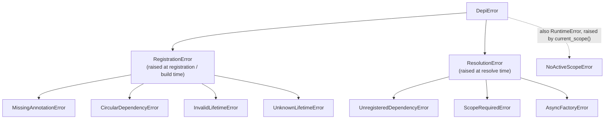

<p align="center">
  
</p>

<h1 align="center">depi</h1>

<p align="center"><strong>Dependency injection for Python, resolved from your constructor type hints.</strong></p>

<p align="center">
  <a href="https://pypi.org/project/pydepi/"></a>
  <a href="https://pypi.org/project/pydepi/"></a>
  <a href="https://github.com/danleonard-nj/depi/actions/workflows/ci.yml"></a>
  <a href="#license"></a>
</p>

---

`depi` builds your object graph from constructor annotations — no wiring configuration, no decorators on your classes, no base classes. The core is **100% pure Python with zero dependencies**: one `py3-none-any` wheel, no compiler, nothing to rebuild for a new platform or interpreter.

It has been in iterative development since 2020 and running in production since 2022 ([lineage](https://github.com/danleonard-nj/framework/tree/main/framework/di)), where it wires a service of **120+ registrations** from a single container — at roughly **2.5x the per-resolution cost of a compiled Cython extension** ([benchmarks](#performance)). It scales down just as well: resolution cost tracks the depth of what you asked for, not the size of the container.

📖 **[Full documentation](https://danleonard-nj.github.io/depi/)** — tutorial, concepts, guides, and API reference.

## Install

```bash
pip install pydepi
```

Nothing else comes with it. Framework support is a separate install — see [Packages](#packages).

## Quick start

```python
from depi import ServiceCollection

class Config:
    def __init__(self):
        self.dsn = 'postgres://localhost/app'

class Database:
    def __init__(self, config: Config):      # resolved from the annotation
        self.dsn = config.dsn

class UserService:
    def __init__(self, db: Database):
        self.db = db

services = ServiceCollection()
services.add_singleton(Config)
services.add_scoped(Database)
services.add_transient(UserService)

provider = services.build_provider()
user_service = provider.resolve(UserService)
```

Every constructor parameter must carry a type annotation; an unannotated parameter is an error at registration time rather than a surprise at resolution time.

The vocabulary — `ServiceCollection`, `ServiceProvider`, and the singleton / scoped / transient split — comes straight from .NET's `Microsoft.Extensions.DependencyInjection`. That model works, and there was no reason to invent another one.

## What you get

- **Three lifetimes.** Transient (new on every resolution), singleton (one per provider), scoped (one per scope, typically per request). Scopes are context managers that dispose what they own, and `async with` awaits async cleanup first. → [Lifetimes and scopes](https://danleonard-nj.github.io/depi/concepts/lifetimes-and-scopes/)
- **Validation before use.** `build_provider()` walks the whole graph: cycles, missing registrations, and singletons depending on shorter-lived services fail at startup rather than in traffic. → [The dependency graph](https://danleonard-nj.github.io/depi/concepts/dependency-graph/)
- **Async throughout.** Async factories, `resolve_async`, mixed sync/async graphs, coroutine-safe singleton creation, and awaited scoped teardown. → [Async](https://danleonard-nj.github.io/depi/concepts/async/)
- **Factories for what annotations cannot reach.** A factory takes one argument — the provider or scope — and resolves what it needs. This is how third-party SDK clients get wired. → [Factories](https://danleonard-nj.github.io/depi/concepts/factories/)
- **The container stays at the boundary.** Application classes take plain constructor arguments; they never import `depi` or call `resolve()`. → [Architecture](https://danleonard-nj.github.io/depi/architecture/)

## Framework integrations

Every adapter does the same three things: open a scope per request, bind it to the ambient context, and dispose it when the request ends. What differs is how the scope reaches your view.

```python
from flask import Flask
from depi_flask import FlaskInjector

app = Flask(__name__)
injector = FlaskInjector(services.build_provider())
injector.setup(app)

@app.route('/users/<user_id>')
@injector.inject
def get_user(user_id, provider):
    return provider.resolve(UserService).get(user_id)
```

| Framework | Package | How the scope reaches the view | Guide |
| --- | --- | --- | --- |
| Flask | `pydepi-flask` | injected argument, or autowire by annotation | [Flask](https://danleonard-nj.github.io/depi/integrations/flask/) |
| Quart | `pydepi-quart` | the same, with async views | [Quart](https://danleonard-nj.github.io/depi/integrations/quart/) |
| FastAPI | `pydepi-fastapi` | `Depends(injector.get_scope)` — your endpoint signature is untouched | [FastAPI](https://danleonard-nj.github.io/depi/integrations/fastapi/) |
| Django | `pydepi-django` | middleware + `@injector.inject`, on both the sync and async paths | [Django](https://danleonard-nj.github.io/depi/integrations/django/) |

**Autowire** (opt-in) resolves annotated parameters and passes them individually, leaving URL arguments for the framework to fill. It is **not available on FastAPI**, which reads endpoint signatures to build request parsing and the OpenAPI schema, and raises at decoration time on any annotation it cannot treat as a Pydantic field.

Anything running inside a request can also reach the scope directly through `current_scope()`, without it being threaded through. → [Integrations](https://danleonard-nj.github.io/depi/integrations/)

## Performance

`dependency-injector` is a **Cython extension** — its `providers`, `containers` and `_cwiring` modules ship as compiled binaries, so its resolution runs as native code. `depi` is pure Python, and every figure below is interpreted bytecode measured against compiled C.

Measured with `pytest-benchmark` on a 12th Gen Intel i7-12800H, Python 3.11.5, against `dependency-injector` 4.48.1:

| Metric                  | `depi` | `dependency-injector` | Ratio           |
| ----------------------- | ------ | --------------------- | --------------- |
| Simple resolution (ns)  | 308.4  | 121.9                 | 2.5x slower     |
| Complex resolution (ns) | 284.0  | 117.5                 | 2.4x slower     |
| Container setup (µs)    | 30.0   | 149.4                 | **5.0x faster** |
| Memory allocation (µs)  | 18.4   | 9.2                   | 2.0x slower     |


**Read the ratios, not the absolute figures.** Repeat runs on the same machine have differed by 8–54% depending on what else was running, while the ratios above held within a few percent across runs. Anyone reproducing these on their own hardware should expect different nanosecond counts and similar proportions.

**What the trade buys**: roughly 2.5x the per-resolution cost of a compiled C extension, in exchange for pure-Python portability and dependency graphs resolved from type annotations with no wiring configuration. Setup is ~5x faster, which favours workloads that build containers often — test suites especially. Resolution cost stays flat as graphs deepen: the complex-graph figure is no worse than the simple one.

On a real container of 98 registrations, four levels deep, `build_provider()` takes **0.28 ms** — paid once, at startup — a singleton `resolve()` takes **0.17 µs**, and a 25-level transient chain takes **14.9 µs**, about 0.6 µs per level. A hundred-service container resolves a shallow dependency exactly as fast as a three-service one.

Reproduce:

```bash
pytest tests/benchmarks --benchmark-enable --benchmark-warmup=on --benchmark-json=tests/benchmark_results.json
```

```bash
python tests/plot_benchmarks.py tests/benchmark_results.json
```

## Thread safety

Singleton resolution is thread-safe; the provider uses an `RLock` so a singleton constructor can resolve further singletons without deadlocking. Coroutine-safe lazy singleton creation uses a per-type `asyncio.Lock`. Scoped instances are isolated per scope, and the ambient scope is a `ContextVar`, so it is isolated per thread and per task. Signature inspection for autowired views happens once at decoration time, not per request.

## Errors

Every failure derives from `DepiError`, so you can catch depi without catching everything. The split is by *when* a failure happens, because that maps to who fixes it — a registration error means the container was described wrongly and shows up at startup; a resolution error means it was asked for something it could not produce.


```mermaid
flowchart TD
    DepiError --> RegistrationError["RegistrationError<br/>(raised at registration / build time)"]
    DepiError --> ResolutionError["ResolutionError<br/>(raised at resolve time)"]
    RegistrationError --> MissingAnnotationError
    RegistrationError --> CircularDependencyError
    RegistrationError --> InvalidLifetimeError
    RegistrationError --> UnknownLifetimeError
    ResolutionError --> UnregisteredDependencyError
    ResolutionError --> ScopeRequiredError
    ResolutionError --> AsyncFactoryError
    DepiError -. "also RuntimeError, raised by current_scope()" .-> NoActiveScopeError
```

Cycles are detected by static analysis at build time, and the message names the whole chain, trimmed to the cycle itself: `Cyclic dependency detected: Order -> Invoice -> Customer -> Order`.

**Backwards compatible.** These previously raised bare `Exception`, and `RuntimeError` for the async-factory guard. Every class still derives from what it used to be, so existing `except Exception` and `except RuntimeError` handlers keep working. → [Errors](https://danleonard-nj.github.io/depi/concepts/errors/)

## Packages

This repository is a monorepo. Each package is its own distribution with its own release cadence, so a framework changing under an adapter never forces a core release — and never drags a web framework into an application that only wanted the container.

| Package          | Import         | Depends on          |
| ---------------- | -------------- | ------------------- |
| `pydepi`         | `depi`         | *nothing*           |
| `pydepi-flask`   | `depi_flask`   | `pydepi`, `flask`   |
| `pydepi-quart`   | `depi_quart`   | `pydepi`, `quart`   |
| `pydepi-fastapi` | `depi_fastapi` | `pydepi`, `fastapi` |
| `pydepi-django`  | `depi_django`  | `pydepi`, `django`  |

Extras work as an alias — `pydepi[flask]`, `[quart]`, `[fastapi]`, `[django]`, `[all]` — but the distribution name is the more accurate form, since these are separate packages with their own versions rather than optional features of core.

## Documentation

- [Getting started](https://danleonard-nj.github.io/depi/getting-started/) — install, register, build, resolve.
- [Tutorial](https://danleonard-nj.github.io/depi/tutorial/) — build and serve a small application, end to end.
- [Concepts](https://danleonard-nj.github.io/depi/concepts/) — lifetimes, factories, async, disposal, graph validation, errors.
- [Guides](https://danleonard-nj.github.io/depi/guides/) — testing, typed configuration, third-party clients, organizing a large container.
- [Integrations](https://danleonard-nj.github.io/depi/integrations/) — Flask, Quart, FastAPI, Django.
- [Architecture](https://danleonard-nj.github.io/depi/architecture/) — keeping the container at the composition boundary.
- [Comparison](https://danleonard-nj.github.io/depi/comparison/) — against manual wiring, Dependency Injector, Injector, Punq, and FastAPI `Depends`.
- [API reference](https://danleonard-nj.github.io/depi/api/) — generated signatures for the public API.

Documentation source lives under [`docs/`](docs/) and is built with MkDocs.

## Development

```bash
pip install -r requirements-dev.txt
```

That installs all five packages in editable mode plus the test toolchain.

```bash
pytest tests/core
```

```bash
pytest tests/integrations
```

```
packages/
  depi-core/      depi/          container, scopes, ambient context, integration base
  depi-flask/     depi_flask/
  depi-quart/     depi_quart/
  depi-fastapi/   depi_fastapi/
  depi-django/    depi_django/
tests/
  core/  integrations/  benchmarks/
```

Tests for every package live together under `tests/`, so an adapter breaking against a new framework release is caught immediately — but they run as separate CI jobs, so a broken adapter cannot turn the core suite red. Adapters build against `depi.integration.BaseInjector` and `depi.context`, and pin `pydepi>=0.1,<0.2`.

## Roadmap

- **Performance**: Cython optimization targeting ~90-100ns resolution to match `dependency-injector`
- **Memory**: optimize metadata storage and allocation patterns
- **Frameworks**: aiohttp integration
- **Tooling**: debug visualizations and dependency graph analysis

## Contributing

Issues and contributions welcome on [GitHub](https://github.com/danleonard-nj/depi). Per-package release notes are in [CHANGELOG.md](CHANGELOG.md), release mechanics in [RELEASING.md](RELEASING.md), and known gaps in [BACKLOG.md](BACKLOG.md). The project follows semantic versioning and maintains backward compatibility within major versions.

## License

MIT
