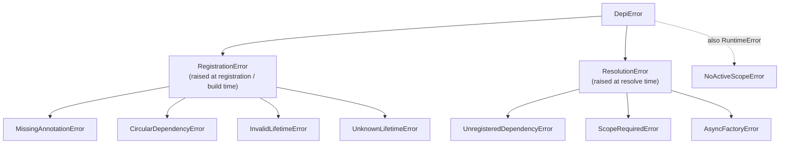

# Exceptions

Every error `depi` raises derives from [`DepiError`][depi.DepiError]. The
hierarchy splits by *when* the failure happens — see
[Errors](../concepts/errors.md) for the reasoning and a table of what raises
what.

`AsyncFactoryError` and `NoActiveScopeError` also derive from `RuntimeError`,
which is what they were before the hierarchy existed.

::: depi.exceptions
    options:
      show_root_heading: false
      members:
        - DepiError
        - RegistrationError
        - MissingAnnotationError
        - CircularDependencyError
        - InvalidLifetimeError
        - UnknownLifetimeError
        - ResolutionError
        - UnregisteredDependencyError
        - ScopeRequiredError
        - AsyncFactoryError
        - NoActiveScopeError
