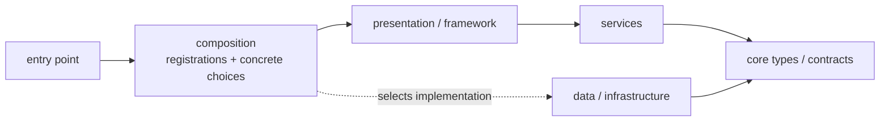

# Architecture

The architectural rule is small: keep dependency wiring at a **composition
boundary**, and give normal services ordinary constructor dependencies.

`depi` does not require DDD, Clean Architecture, repositories, protocols, or a
particular folder structure. Those patterns remain available when they fit. A
pragmatic `core/data → services → presentation` application is equally valid.

## The boundary



The composition code imports `depi` and names concrete implementations. A
framework adapter may also hold the provider so it can open and close request
scopes. The services in the middle receive dependencies through constructors
and do not resolve more dependencies while they run.

The diagram shows one common layout, not an import rule enforced by the
container. The useful property is that application behavior can still be
constructed directly in a test or under another entry point.

## A layered example

This example registers a user through a service. The storage interface is useful
because its implementation may vary by environment; DEPI does not require an
interface for every dependency.

### Core types and contract

```python
# core/users.py
from dataclasses import dataclass
from typing import Protocol

@dataclass
class User:
    email: str

class UserStore(Protocol):
    def contains(self, email: str) -> bool: ...
    def add(self, user: User) -> None: ...
```

### Data implementation

```python
# data/users.py
from core.users import User

class InMemoryUserStore:
    def __init__(self):
        self._users: dict[str, User] = {}

    def contains(self, email: str) -> bool:
        return email in self._users

    def add(self, user: User) -> None:
        self._users[user.email] = user
```

The concrete store has no container dependency. A database-backed class could
take a connection pool in exactly the same way.

### Service

```python
# services/register_user.py
from core.users import User, UserStore

class EmailAlreadyRegistered(Exception):
    pass

class RegisterUser:
    def __init__(self, users: UserStore):
        self._users = users

    def register(self, email: str) -> User:
        if self._users.contains(email):
            raise EmailAlreadyRegistered(email)
        user = User(email=email)
        self._users.add(user)
        return user
```

`RegisterUser` knows about its collaborator, not how that collaborator is
selected or constructed. It can be called from HTTP, a CLI, or a worker.

### Composition

```python
# composition.py
from depi import ServiceCollection, ServiceProvider
from core.users import UserStore
from data.users import InMemoryUserStore
from services.register_user import RegisterUser

def build_provider() -> ServiceProvider:
    services = ServiceCollection()
    services.add_scoped(UserStore, InMemoryUserStore)
    services.add_transient(RegisterUser)
    return services.build_provider()
```

This is where the application chooses `InMemoryUserStore` and the service
lifetimes. A production composition can choose a database implementation without
editing `RegisterUser`.

### Presentation boundary

```python
# web.py
from flask import Flask, request
from depi_flask import FlaskInjector
from composition import build_provider
from services.register_user import EmailAlreadyRegistered, RegisterUser

def create_app() -> Flask:
    app = Flask(__name__)
    injector = FlaskInjector(build_provider(), autowire=True)
    injector.setup(app)

    @app.post("/users")
    @injector.inject
    def register_user(service: RegisterUser):
        try:
            user = service.register(request.get_json()["email"])
        except EmailAlreadyRegistered:
            return {"error": "email already registered"}, 409
        return {"email": user.email}, 201

    return app
```

The adapter opens a request scope and supplies the service. The view translates
HTTP input and output; the service does not import Flask or `depi`. Resolving the
service explicitly from the injected scope is also valid when autowiring is not
available, as with FastAPI.

## Other entry points

A CLI or worker owns its scope and resolves one handler at the boundary:

```python
# cli.py
from composition import build_provider
from services.register_user import RegisterUser

def main(email: str) -> None:
    provider = build_provider()
    with provider.create_scope() as scope:
        user = scope.resolve(RegisterUser).register(email)
        print(user.email)
```

After `RegisterUser` is resolved, normal application calls do not return to the
container. Background workers follow the same pattern: open a scope for one job,
resolve the job handler, run it, and close the scope.

## Testing without container coupling

The service can be tested directly:

```python
from data.users import InMemoryUserStore
from services.register_user import RegisterUser

def test_registers_a_user():
    service = RegisterUser(InMemoryUserStore())
    assert service.register("a@example.com").email == "a@example.com"
```

Use a test container when the wiring itself is under test or when replacing one
registration is more convenient. See [Testing with replacement
dependencies](../guides/testing.md).

## Practical rules

1. Put registrations and environment-specific choices in a composition module.
2. Resolve a service or handler at an entry point or through a framework adapter.
3. Pass dependencies into application classes; do not fetch them mid-operation.
4. Introduce interfaces where substitution is useful, not to satisfy DEPI.
5. Match scopes to real units of work such as a request, message, or command.

The library cannot enforce this boundary: a `ServiceProvider` can be passed
anywhere. Keeping it at the edge is an application design choice.
