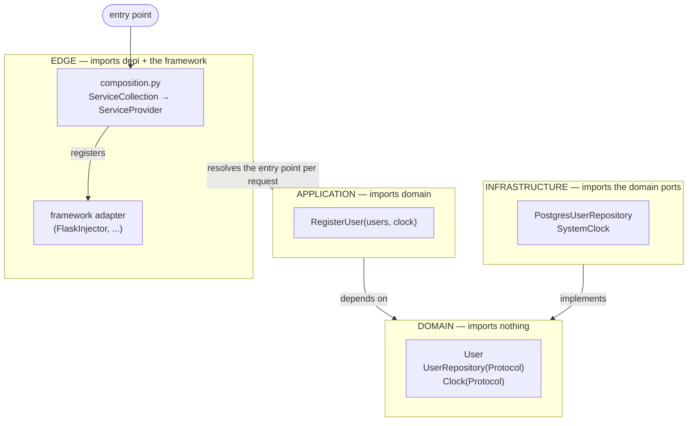

# Architecture

> Dependency injection without letting the container become the application
> architecture.

This page is a worked example of that sentence. It builds a small feature across
the layers of a clean architecture, wires it with `depi`, exposes it over a web
framework, and substitutes its infrastructure in a test — and it marks the exact
line where `depi` stops being imported.

## When the container *is* the architecture

A DI container has become the architecture when removing it means rewriting the
application. Symptoms:

- application or domain modules `import depi`,
- domain methods call `resolve()` or `current_scope()` to fetch collaborators
  mid-computation,
- classes cannot be instantiated in a plain test without a built container,
- the lifetime of a business object is defined by a container scope rather than
  by the code that uses it,
- "add a dependency" means "edit this class *and* a registration *and* a
  framework binding".

At that point the container is load-bearing structure. The wiring convenience it
bought is now a coupling every file pays.

## The shape that avoids it



Only the **edge** box imports `depi`. Dependencies point inward: infrastructure
depends on the domain ports, never the reverse. The composition root is the only
place that names a concrete infrastructure class.

## The example

Feature: register a user. One entity, one port per external dependency, one
application service, concrete infrastructure, a composition root, a web adapter,
and a test.

### Domain — imports nothing

```python
# domain/user.py
from dataclasses import dataclass

@dataclass
class User:
    id: str
    email: str
    created_at: str
```

```python
# domain/ports.py
from typing import Protocol
from domain.user import User

class UserRepository(Protocol):
    def by_email(self, email: str) -> User | None: ...
    def add(self, user: User) -> None: ...

class Clock(Protocol):
    def now_iso(self) -> str: ...
```

No `depi` import. No framework import. These types describe the problem, not the
plumbing. They can be constructed and asserted on in a test with `User("1", ...)`.

### Application — imports domain only

```python
# application/register_user.py
import uuid
from domain.user import User
from domain.ports import Clock, UserRepository

class EmailAlreadyRegistered(Exception):
    pass

class RegisterUser:
    def __init__(self, users: UserRepository, clock: Clock):
        self._users = users
        self._clock = clock

    def __call__(self, email: str) -> User:
        if self._users.by_email(email):
            raise EmailAlreadyRegistered(email)
        user = User(id=str(uuid.uuid4()), email=email, created_at=self._clock.now_iso())
        self._users.add(user)
        return user
```

`RegisterUser` takes its collaborators as constructor parameters, typed as the
domain ports. It does not know whether `UserRepository` talks to Postgres or a
dict, and it has no way to find out — there is no container in scope. **This is
the class the whole structure exists to protect.**

### Infrastructure — imports domain ports

```python
# infrastructure/postgres_user_repository.py
from domain.user import User
from domain.ports import UserRepository

class PostgresUserRepository:                 # structurally a UserRepository
    def __init__(self, pool: "ConnectionPool"):
        self._pool = pool

    def by_email(self, email: str) -> User | None:
        with self._pool.connection() as conn:
            row = conn.execute("select id, email, created_at from users where email = %s", [email]).fetchone()
            return User(*row) if row else None

    def add(self, user: User) -> None:
        with self._pool.connection() as conn:
            conn.execute("insert into users (id, email, created_at) values (%s, %s, %s)",
                         [user.id, user.email, user.created_at])
```

```python
# infrastructure/system_clock.py
from datetime import datetime, timezone

class SystemClock:
    def now_iso(self) -> str:
        return datetime.now(timezone.utc).isoformat()
```

Infrastructure classes take *their* dependencies (a connection pool) as
constructor parameters too. Still no `depi` import — they are just classes.

### Composition root — imports depi

This is the first file that imports `depi`.

```python
# composition.py
from depi import ServiceCollection, ServiceProvider

from application.register_user import RegisterUser
from domain.ports import Clock, UserRepository
from infrastructure.config import AppConfig, load_config
from infrastructure.connection_pool import ConnectionPool
from infrastructure.postgres_user_repository import PostgresUserRepository
from infrastructure.system_clock import SystemClock

def build_container() -> ServiceProvider:
    services = ServiceCollection()

    services.add_singleton(AppConfig, instance=load_config())
    services.add_singleton(ConnectionPool, factory=_make_pool)
    services.add_singleton(Clock, SystemClock)
    services.add_scoped(UserRepository, PostgresUserRepository)
    services.add_transient(RegisterUser)

    return services.build_provider()

def _make_pool(provider) -> "ConnectionPool":
    return ConnectionPool(provider.resolve(AppConfig).database_dsn)
```

Every concrete choice — Postgres, the system clock, how the pool is built, what
is a singleton vs. scoped — is here and only here. Swapping `PostgresUserRepository`
for another implementation is a one-line edit in this file; nothing in
`application/` or `domain/` changes.

### Web adapter — imports depi and the framework

```python
# web.py
from flask import Flask, request
from depi_flask import FlaskInjector

from application.register_user import EmailAlreadyRegistered, RegisterUser
from composition import build_container

def create_app() -> Flask:
    app = Flask(__name__)
    injector = FlaskInjector(build_container())
    injector.setup(app)

    @app.post("/users")
    @injector.inject
    def register(provider):
        register_user = provider.resolve(RegisterUser)
        try:
            user = register_user(request.json["email"])
        except EmailAlreadyRegistered:
            return {"error": "email already registered"}, 409
        return {"id": user.id, "email": user.email}, 201

    return app
```

The view is the framework boundary. It pulls `RegisterUser` out of the request
scope and calls it. The framework adapter opened that scope, bound it, and will
dispose it — including the scoped `PostgresUserRepository` — when the request
ends. HTTP concerns (parsing `request.json`, status codes) stay in this file;
`RegisterUser` deals in an email string and a `User`.

### Where depi is, and is not

| File | imports `depi`? |
| --- | --- |
| `domain/user.py`, `domain/ports.py` | no |
| `application/register_user.py` | no |
| `infrastructure/*.py` | no |
| `composition.py` | **yes** |
| `web.py` | **yes** (and the framework) |
| `main.py` | via `composition` / `web` |

Three of the six layers never see the container. `application/` and `domain/`
import only each other. You can delete `composition.py` and `web.py`, write a
CLI entry point that constructs `RegisterUser(PostgresUserRepository(pool),
SystemClock())` by hand, and every domain and application module compiles and
runs unchanged. That is the property "the container is not the architecture"
buys you.

## Test substitution — infrastructure swapped, application untouched

```python
# tests/test_register_user.py
from depi import ServiceCollection

from application.register_user import EmailAlreadyRegistered, RegisterUser
from domain.ports import Clock, UserRepository
from domain.user import User

class InMemoryUserRepository:
    def __init__(self):
        self._by_email: dict[str, User] = {}
    def by_email(self, email): return self._by_email.get(email)
    def add(self, user): self._by_email[user.email] = user

class FixedClock:
    def now_iso(self): return "2020-01-01T00:00:00+00:00"

def build_test_container():
    services = ServiceCollection()
    services.add_singleton(Clock, instance=FixedClock())
    services.add_scoped(UserRepository, InMemoryUserRepository)
    services.add_transient(RegisterUser)
    return services.build_provider()

def test_registers_a_new_user():
    provider = build_test_container()
    with provider.create_scope() as scope:
        register = scope.resolve(RegisterUser)
        user = register("a@example.com")
        assert user.created_at == "2020-01-01T00:00:00+00:00"

def test_rejects_a_duplicate_email():
    provider = build_test_container()
    with provider.create_scope() as scope:
        register = scope.resolve(RegisterUser)
        register("a@example.com")
        try:
            register("a@example.com")
            assert False
        except EmailAlreadyRegistered:
            pass
```

The test container registers the same `RegisterUser` — the real class, real
logic — against fake infrastructure. No production code is imported into a
"testable" shape; there is no shape. `RegisterUser` also composes fine with no
container at all:

```python
def test_without_a_container():
    register = RegisterUser(InMemoryUserRepository(), FixedClock())
    assert register("a@example.com").email == "a@example.com"
```

Both styles work because `RegisterUser` only ever asked for two constructor
parameters. See [Testing](../guides/testing.md).

## Rules this example follows

1. **Dependencies point inward.** Infrastructure imports domain ports; domain
   imports nothing.
2. **One composition root.** Concrete types are named in exactly one module.
3. **The container stays at the edge.** `domain/` and `application/` do not
   import `depi`; only `composition.py` and the framework adapter do.
4. **Ports are the application's, not the container's.** `UserRepository` is a
   `Protocol` in `domain/`. `depi` uses it as a key; it is not a `depi` concept.
5. **Framework concerns stop at the view.** Request parsing and status codes
   live in `web.py`; `RegisterUser` takes a string and returns a `User`.
6. **Substitution is a registration change.** Tests and alternate environments
   swap implementations in a composition root, not by editing application code.
