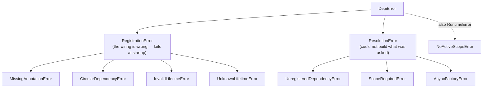

# Errors

Every exception `depi` raises derives from [`DepiError`][depi.DepiError], so an
application can catch `depi`'s failures without catching everything else.

## The split

The hierarchy is grouped by *when* a failure happens, because that maps to who
fixes it:



A [`RegistrationError`][depi.RegistrationError] means the wiring is wrong — fix
the composition root, fail startup loudly. A
[`ResolutionError`][depi.ResolutionError] means the container could not build
what was asked of it at that moment.

## What raises what

| Condition | Exception | Raised at |
| --- | --- | --- |
| Constructor parameter with no annotation | [`MissingAnnotationError`][depi.MissingAnnotationError] | the `add_*` call |
| Cycle in the graph | [`CircularDependencyError`][depi.CircularDependencyError] | `build_provider()` |
| Singleton depends on a scoped or transient service | [`InvalidLifetimeError`][depi.InvalidLifetimeError] | `build_provider()` |
| Unrecognised lifetime string | [`UnknownLifetimeError`][depi.UnknownLifetimeError] | resolve |
| Singleton dependency never registered | [`UnregisteredDependencyError`][depi.UnregisteredDependencyError] | `build_provider()` |
| Transient/scoped dependency never registered | [`UnregisteredDependencyError`][depi.UnregisteredDependencyError] | first resolve |
| Scoped service resolved with no scope | [`ScopeRequiredError`][depi.ScopeRequiredError] | resolve |
| Async factory resolved through `resolve()` | [`AsyncFactoryError`][depi.AsyncFactoryError] | resolve |
| `current_scope()` with nothing bound | [`NoActiveScopeError`][depi.NoActiveScopeError] | the call |

## Backwards compatibility

`depi` used to raise bare `Exception`, and `RuntimeError` for the async-factory
guard. Every class still derives from what it used to be:

- all of them subclass `Exception`,
- `AsyncFactoryError` and `NoActiveScopeError` also subclass `RuntimeError`.

So `except Exception` and `except RuntimeError` handlers written against the old
behaviour keep working.

`NoInjectorRegisteredError` (from `depi_django`) is the exception to the
hierarchy: it subclasses `RuntimeError` only, not `DepiError`, because it is
raised by the Django adapter, not the core container.

## Catching at the boundary

```python
from depi import DepiError, RegistrationError

try:
    provider = build_container()
except RegistrationError as exc:
    raise SystemExit(f"container misconfigured: {exc}")
```

A bug inside your own factory passes straight through — `depi` does not wrap
arbitrary exceptions, so `except DepiError` will not swallow a `KeyError` from
your code. See [Handling errors at startup](../guides/error-handling.md).
