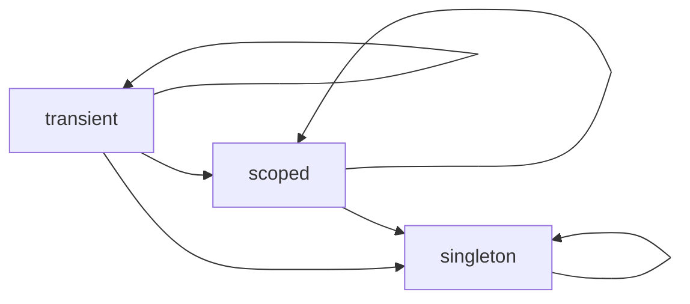

# Lifetimes and scopes

A lifetime answers: when the container needs this type, does it build a new
instance, reuse one, or reuse one *for a while*?

## The three lifetimes

| Lifetime | Instances | Set with |
| --- | --- | --- |
| **Transient** | a new one on every resolution | [`add_transient`][depi.ServiceCollection.add_transient] |
| **Singleton** | one for the life of the provider | [`add_singleton`][depi.ServiceCollection.add_singleton] |
| **Scoped** | one per scope | [`add_scoped`][depi.ServiceCollection.add_scoped] |

`Lifetime` is exposed as [`depi.Lifetime`][depi.Lifetime] — a class with three
string constants (`Lifetime.Singleton`, `Lifetime.Transient`, `Lifetime.Scoped`),
used by `register_many` and readable on a `DependencyRegistration`.

### Transient

```python
services.add_transient(RequestParser)
a = provider.resolve(RequestParser)
b = provider.resolve(RequestParser)
assert a is not b
```

Use for stateless helpers, or objects that must not be shared.

### Singleton

```python
services.add_singleton(ConnectionPool)
assert provider.resolve(ConnectionPool) is provider.resolve(ConnectionPool)
```

Constructed lazily on first resolve by default, then cached. Pass `eager=True`
(or call `build_provider(eager_all=True)`) to construct at build time instead —
useful when you want a bad configuration to fail at startup, or a connection
opened before the first request. A singleton registered by
[factory](factories.md) or `instance=` is always ready after `build_provider()`.

Use for shared, expensive, or stateful-but-safe-to-share resources: config,
connection pools, clients, caches.

### Scoped

```python
services.add_scoped(UnitOfWork)

with provider.create_scope() as scope:
    uow = scope.resolve(UnitOfWork)
    assert scope.resolve(UnitOfWork) is uow      # same instance in this scope
```

One instance per scope. A different scope gets a different instance. Resolving a
scoped service with no scope — straight from the provider — raises
[`ScopeRequiredError`][depi.ScopeRequiredError].

Use for anything whose lifetime is one unit of work: the current request's
user, a database session/transaction, a per-request cache.

## Scopes

A scope is created from the provider and used as a context manager:

```python
with provider.create_scope() as scope:
    handler = scope.resolve(RequestHandler)
    handler.run()
# scope disposed here
```

Inside a scope, [`scope.resolve`][depi.ServiceScope.resolve]:

- **singleton** → delegates to the provider (shared across all scopes),
- **scoped** → the scope's own instance, constructed on first request and cached,
- **transient** → a new instance each call.

When the `with` block exits, [`dispose()`][depi.ServiceScope.dispose] is called:
every scoped instance with a `dispose()` method has it invoked, then the scope's
caches are cleared. `async with` additionally awaits `__aexit__` on scoped
instances that define it, before `dispose()`. See [Disposal](disposal.md).

Scopes are cheap to create. Nesting is allowed — an inner scope is independent of
the outer one, not a child of it.

### Lifetime rule: no widening downward

A singleton may not depend on a scoped or transient service. `build_provider()`
raises [`InvalidLifetimeError`][depi.InvalidLifetimeError] if it finds one.

The reason: the singleton's constructor runs once, so it would capture *one*
instance of the shorter-lived dependency and hold it forever — a transient that
never varies, or a scoped instance leaking out of its scope. This is checked for
constructor-injected dependencies; a singleton built by a
[factory](factories.md) that resolves a transient itself is not checked, because
the factory author has taken responsibility for it.

Allowed dependencies — an arrow means *may depend on*:



The rejected cases are the arrows this graph omits: singleton → scoped and
singleton → transient.

## Reaching the scope without passing it around

Framework adapters open a scope per request and bind it to a `ContextVar` in
[`depi.context`][depi.context]. Code running within that request can retrieve it:

```python
from depi import current_scope, get_current_scope

scope = current_scope()          # raises NoActiveScopeError if none is bound
scope = get_current_scope()      # returns None instead
```

To bind a scope yourself — in a background worker, a CLI command, a test:

```python
from depi import use_scope

with provider.create_scope() as scope:
    with use_scope(scope):
        current_scope().resolve(UnitOfWork)
```

`use_scope` only binds and unbinds; it does not dispose. Disposal stays with
whoever created the scope, because the safe moment differs by context (Flask at
`teardown_request`, ASGI after the response body is sent).

Using the ambient scope pulls `depi` into whatever module calls `current_scope()`.
Prefer passing the resolved object as a parameter; reach for the contextvar only
at the framework edge or in code that is already framework-aware.

## API

- [`ServiceProvider.create_scope`](../api/container.md#depi.ServiceProvider.create_scope)
- [`ServiceScope`](../api/container.md#servicescope)
- [Ambient scope](../api/context.md)
