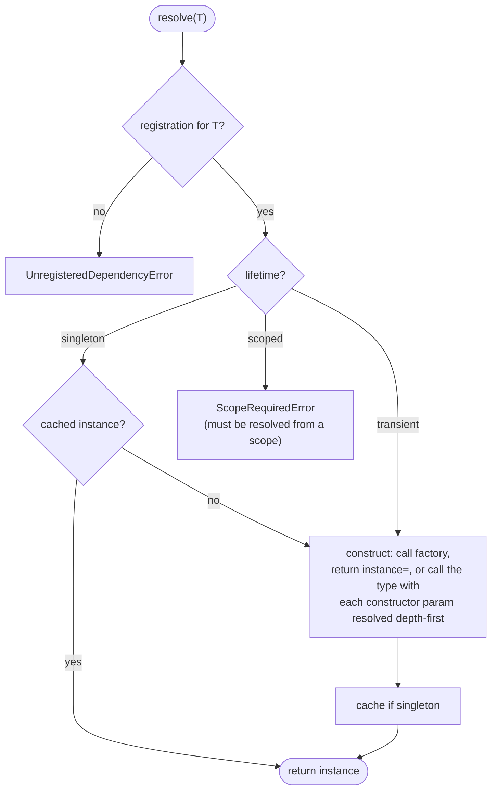

# Resolution

Resolution is asking the container for an object. `depi` constructs it, along
with everything it transitively needs, and returns it.

```python
provider = services.build_provider()
service = provider.resolve(OrderService)
```

## How a type is resolved

For `resolve(T)`:

1. Look up the registration for `T`. No registration →
   [`UnregisteredDependencyError`][depi.UnregisteredDependencyError].
2. Branch on the lifetime:
   - **singleton** — return the cached instance if there is one; otherwise
     construct it, cache it, return it.
   - **transient** — construct a new instance every call.
   - **scoped** — raise [`ScopeRequiredError`][depi.ScopeRequiredError]. Scoped
     services must be resolved from a scope (see
     [Lifetimes and scopes](lifetimes-and-scopes.md)).
3. To construct: if the registration has a `factory`, call it. If it has an
   `instance`, return that. Otherwise call the implementation type with each
   constructor parameter resolved from its annotation.

Constructor parameters are resolved depth-first, so a dependency is fully built
before the thing that needs it. The cost of a `resolve` call is proportional to
the depth of the graph below the requested type, not to the size of the
container.



## Reading annotations

`depi` reads the type annotation on each `__init__` parameter and uses it as the
key to look up that parameter's registration. Parameter *names* are irrelevant;
only the annotation matters.

```python
class OrderService:
    def __init__(self, repo: OrderRepository, clock: Clock):
        ...
# needs a registration for OrderRepository and one for Clock
```

Annotations stored as strings — from `from __future__ import annotations` or
quoted forward references — are evaluated when the signature is inspected. A name
that cannot be resolved raises `NameError` at registration time rather than
being silently skipped.

Default values do not make a parameter optional to the container: if a parameter
is annotated, `depi` will try to resolve it. There is no "resolve if registered,
else use the default" behaviour. To make a dependency genuinely optional, use a
[factory](factories.md) that catches `UnregisteredDependencyError`.

## Sync and async

[`resolve`][depi.ServiceProvider.resolve] is synchronous.
[`resolve_async`][depi.ServiceProvider.resolve_async] is the coroutine form; it
is required for [async factories](async.md) and awaits async constructor
dependencies. Calling `resolve` on a type with an async factory raises
[`AsyncFactoryError`][depi.AsyncFactoryError] pointing you at `resolve_async` —
it never returns an un-awaited coroutine.

Singletons resolved either way share one cache, so `resolve(Config)` and
`await resolve_async(Config)` return the same object.

## Who should call `resolve`

As few places as possible. In a well-structured application the only callers are
the [composition root](registration.md#the-composition-root) and the framework
adapter at the HTTP edge, which resolves the top-level handler or service for
each request. Application and domain classes receive their dependencies through
their constructors and never see the provider.

Calling `resolve` from inside a domain object turns the container into a
[service locator](../comparison/index.md#service-locator) — the object now can't
be constructed or tested without a configured container. See
[Architecture](../architecture/index.md).

## Thread and task safety

- Singleton construction is guarded, so concurrent `resolve` calls for the same
  uninitialised singleton produce one instance. The lock is re-entrant, so a
  singleton constructor may resolve other singletons.
- Async singleton construction uses a per-type lock, so independent singletons
  can be built concurrently.
- Transient resolution holds no locks.
- Scoped instances are isolated per scope, and the ambient scope is a
  `ContextVar`, so it is per-thread and per-task.

## API

- [`ServiceProvider.resolve`](../api/container.md#depi.ServiceProvider.resolve)
- [`ServiceProvider.resolve_async`](../api/container.md#depi.ServiceProvider.resolve_async)
